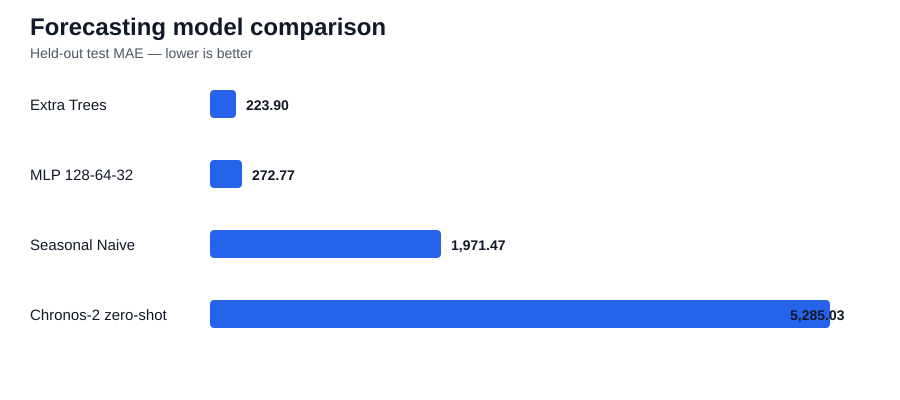

# AM2-02 — Time-Series Foundation Model Benchmark

A comparative forecasting project using the **UCI Power Consumption of Tetouan City** dataset.

The project compares:

**statistical baselines → machine learning → neural forecasting → pretrained time-series foundation models**

The central constraint is temporal integrity: future observations must never leak into model development.

## Experiment status

- ✅ CI passing
- ✅ Statistical benchmark executed
- ✅ Expanding-window ML benchmark executed
- ✅ Neural benchmark executed
- ✅ Chronos-2 zero-shot benchmark executed
- ✅ Real results committed under `evidence/`

## Key results

| Model family | Model | MAE | RMSE | MAPE | sMAPE |
|---|---|---:|---:|---:|---:|
| Statistical | Seasonal Naive | 1,971.47 | 2,574.21 | 6.56 | 6.90 |
| Machine Learning | **Extra Trees** | **223.90** | **330.03** | **0.79** | **0.78** |
| Neural | MLP 128-64-32 | 272.77 | 383.62 | 0.98 | 0.97 |
| Foundation model | Chronos-2 zero-shot | 5,285.03 | 6,801.51 | 16.60 | 18.96 |



## What the experiment shows

The executed benchmark found **Extra Trees** to be the strongest model on the held-out test set. It substantially outperformed the seasonal-naive statistical baseline, the MLP neural baseline and the zero-shot Chronos-2 foundation model.

The result is important because it demonstrates that a newer foundation model is **not automatically the best engineering choice**. Chronos-2 was both less accurate and more expensive at inference in this particular experiment.

### Runtime and resource observations

- MLP prediction time: about **0.011 s**
- Chronos-2 prediction time: about **86.2 s**
- MLP measured peak Python memory: about **12.8 MB**
- Chronos-2 measured peak Python memory: about **223 MB**

### Probabilistic Chronos evaluation

- nominal interval: 80%
- empirical interval coverage: **61.8%**
- mean interval width: **9,885.84**

The zero-shot foundation-model intervals were wide but still under-covered the observed values.

### Residual analysis

The Extra Trees model produced:

- mean absolute error: **223.90**
- median absolute error: **157.78**
- maximum absolute error: **5,348.57**

The largest average error occurred around **17:00**, indicating a useful time-of-day pattern for future feature engineering or model diagnostics.

## Model families

### Statistical
- naive
- seasonal naive
- Holt-Winters exponential smoothing

### Machine learning
- Random Forest
- Extra Trees
- Histogram Gradient Boosting
- leakage-safe lag/rolling/calendar features
- expanding-window validation

### Neural
- three-hidden-layer MLP regression baseline

### Foundation model
- Amazon Chronos-2 zero-shot forecasting

## Evaluation

- MAE
- RMSE
- MAPE
- sMAPE
- runtime
- approximate peak Python memory
- probabilistic interval coverage
- mean interval width
- residual/error analysis by hour and day
- temporal validation and leakage controls

## Reproduce the experiment

```bash
python -m venv .venv
.venv\Scripts\activate
python -m pip install --upgrade pip
pip install -e ".[dev]"

python scripts/download_data.py
python scripts/run_baselines.py
python scripts/run_ml_forecasting.py
python scripts/run_neural_forecasting.py
python scripts/finalise_project.py
pytest
```

Optional Chronos-2 run:

```bash
pip install -e ".[foundation]"
python scripts/run_chronos_forecasting.py
python scripts/finalise_project.py
```

## Evidence

- [Full experiment summary](evidence/RESULTS.md)
- [Final machine-readable summary](evidence/final_project_summary.json)
- [Model-family comparison](evidence/tables/model_family_comparison.csv)
- [Expanding-window CV results](evidence/tables/phase2_expanding_window_cv.csv)
- [Error by hour](evidence/tables/phase4_error_by_hour.csv)
- [How to run the real experiment](docs/running_real_experiment.md)

## Documentation

- `docs/dataset.md`
- `docs/methodology.md`
- `docs/phase2_ml_forecasting.md`
- `docs/phase3_deep_foundation_models.md`
- `docs/model_card.md`
- `docs/deployment_mlops.md`
- `docs/final_summary.md`
- `docs/final_reflection.md`
- `docs/am2_evidence.md`

## Responsible use

This is an educational benchmark. Historical public-data performance is not sufficient evidence for live grid-operation, trading or infrastructure decisions.

## Licence

Code: MIT. Dataset: UCI source licence/citation requirements apply.
